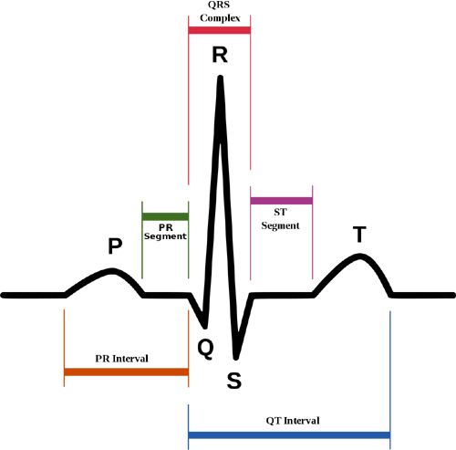

# HeartSense - Illuminating Your Heart's Rhythm

## Pseudo Code logic (should you stumble upon this project these are my preliminary ideas as to how this could be done)

Recieve ECG signal (options):

- Get HIGH / LOW signal from each heartbeat (and map it to a pre-defined simulation of a normal pulse waveform)
- Get the exact pulse waveform and map local minima and maxima to to some visualization (this option depends on the granularity of sensor)

Steady signal obtained, now what?

Normal case (steady resting heartrate)

- Set the the local minima really low, like a brightness of RGB(15, 0, 0,)
  - Local maxima will have slightly higher brightness levels depending on their relative wavesize RGB(30/20, 0, 0) (?)
  - Local minima will have slightly lower brightness levels depending om their relative wavesize (RGB5/10,0, 0) (?)

Showing rate of change (faster or slower)

- ???

Possible ideas:

- Brightness levels can be changed
- Pixel intensity levels can be changed
- The various LEDs can denote different things
  - If a LED ring with center LEDs is chosen it can have slightly higer values than the outer LEDs (or vice versa)
<

## Overview

HeartSense is an interactive LED ring that visually represents your heartbeats in real-time. The LED ring blinks to your heartbeats and displays the current BPM (beats per minute) using both numerical values and color-coded illumination.

## Features

- Real-time heart rate monitoring using ECG.
- LED ring that blinks in sync with your heartbeat.
- Displays BPM with color-coded LED illumination.
- Affective computing elements that visually convey heart rate changes.

## Components

- ECG sensor
- LED ring
- Microcontroller (e.g., Arduino, Raspberry Pi)
- Power supply
- Connecting wires and resistors

## Schematics

**Important note:** you can't connect MOSI, MISO, SCK wires to any other Arduino pins. SPI hardware sits on D11, D12, D13 and won't work if not connected there. All other pins can be changed (if you'll make corresponding changes in the program).

### Connectivity

## Installation

### Hardware Setup

1. Connect the ECG sensor to the microcontroller.
2. Attach the LED ring to the microcontroller.
3. Ensure all connections are secure and powered correctly.

## Pulse Sensor: Technical Specifications

Here are the technical specifications:

| Parameter                     |      Value      |
| ----------------------------- | :-------------: |
| **VCC** (Voltage)             |   3.0 – 5.5V    |
| **IMax** (Maximum Current)    |      < 4mA      |
| **VOut** (Output Voltage)     |   0.3V to Vcc   |
| **LED Output** (Wavelength)   |      565nm      |
| **Sensor Input** (Wavelength) |      525nm      |
| **Dimensions** (L x W, PCB)   | 15.8mm (0.625") |
| **Lead Length**               |   20cm (7.8")   |

## How Does a Pulse Sensor Work?

The theory behind optical heart-rate sensors is straightforward. If you've ever shined a flashlight through your fingers and observed your heartbeat pulsing, the concept of optical heart-rate pulse sensors becomes clear.

  

  

A pulse sensor, like any other optical heart-rate sensor, works by shining a green light (~ 550nm) on the finger and measuring the amount of reflected light with a [photosensor](https://en.wikipedia.org/wiki/Photodetector).

  

This optical pulse detection technique is known as a [Photoplethysmogram](https://en.wikipedia.org/wiki/Photoplethysmogram).

The oxygenated hemoglobin in arterial blood absorbs green light. The redder the blood (the higher the hemoglobin), the greater the absorption of green light. With each heartbeat, blood is pumped through the finger, causing a change in the amount of reflected light, which produces a waveform at the photosensor’s output.

As you keep shining light and taking photosensor readings, you quickly begin to obtain a heartbeat pulse reading.

This signal from the photosensor is typically small and noisy; therefore, it is passed through an R/C filter network and then amplified with an [Operational Amplifier](https://en.wikipedia.org/wiki/Operational_amplifier) to create a signal that is significantly larger, cleaner, and easier to detect.

## The Human Heartbeat

  

**P wave** - It is the trailing wave on the left of the QRS complex.
**QRS complex** - It is an impulse generated by ventricular contraction.
**T wave** - It is a leading wave right to the QRS complex.
**U wave** - It is not always observed due to its low peak value.

I have created a [synthetic ECG signal](https://wokwi.com/projects/405107217963893761) for you to play around with to understand the type of input we can expect.

## Heart Rate Variability (HRV)

Heart Rate Variability (HRV) is a crucial metric in understanding heart health and overall well-being. Contrary to what one might initially assume, a healthy heart doesn't beat with perfect regularity like a metronome. Instead, there are slight variations in the time intervals between heartbeats, even when at rest.

### Understanding HRV

To use an analogy, if the heart were an engine:
- At idle, it doesn't maintain a steady RPM. The intervals between beats have a pseudo-random variability.
- When working at an increased rate, these intervals become less stochastic and maintain a steadier rhythm.

The nature and significance of HRV are subjects of ongoing scientific research. Its implications for health are profound, as explained by [Bryn Farnthworth](https://imotions.com/blog/learning/best-practice/heart-rate-variability/):

> "One of the first things to know when understanding heart rate is that the most informative metric relies not just on the heart rate, but how much the heart rate varies. What's often at first glance counter-intuitive about this metric is that a higher heart rate variability (HRV) is associated with good health – the more your heart jumps around (to an extent, of course), the readier you are for action. On the other hand, a low HRV is associated with ill health – it is a significant predictor of mortality from several diseases."

### Importance of HRV

1. **Indicator of Health**: A higher HRV generally indicates better cardiovascular fitness and a more responsive autonomic nervous system.
2. **Stress Marker**: Lower HRV can be an indicator of stress or overtraining in athletes.
3. **Predictive Value**: HRV can be a predictor of various health issues, making it a valuable metric for preventive healthcare.

In the context of HeartSense, monitoring HRV could provide users with deeper insights into their overall health and stress levels, beyond just tracking heart rate.